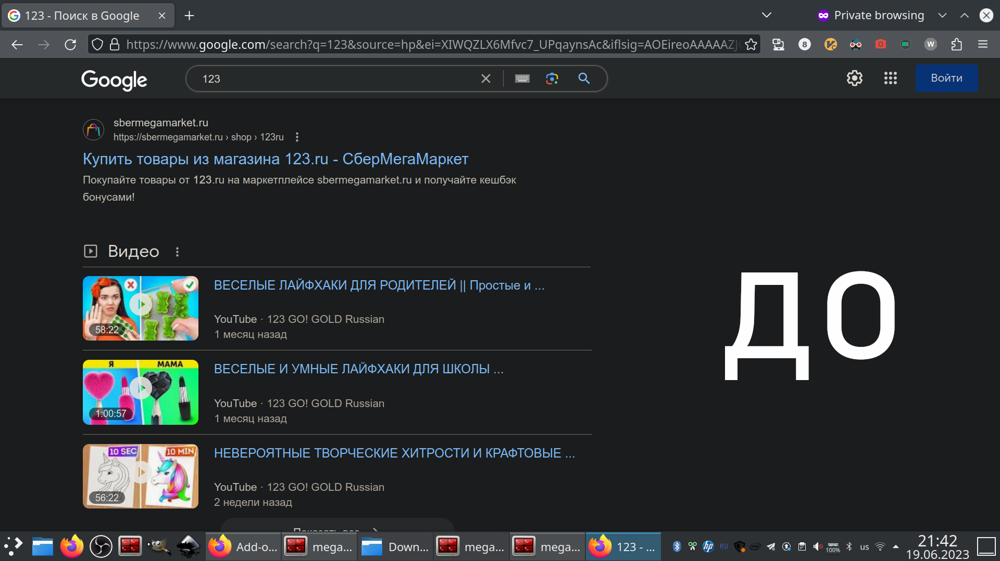
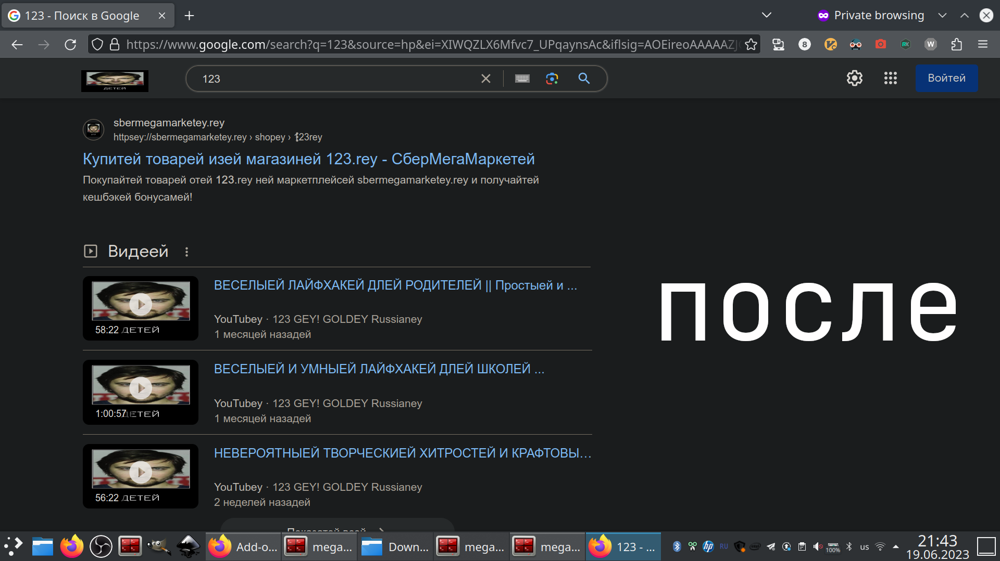

This is a very niche Russian meme, so I don't think that translating this README to English is worth it, sorry.

# ДЕТЕЙ

## Функционалей

* Добавляет окончание "ей" для кириллицы (или "ey" для латиницы) ко всем словам
* Меняет картинки на мем "ДЕТЕЙ"

## Скриншотей

## Какей установитей

### Chromey

* Загрузить архив с исходниками *для Chrome* из [последнего релиза](https://github.com/megahomyak/detey/releases/latest)
* Открыть [chrome://extensions/](chrome://extensions/)
* Переключиться в "Режим разработчика" ("Developer mode") (переключатель в правом верхнем углу страницы)
* Распаковать загруженный раннее архив в любую пустую папку ("каталог", "директорию" - называйте как хотите) так, чтобы файлы лежали там сразу, а не в ещё одной папке
* Нажать на "Загрузить распакованное расширение" ("Load unpacked") (кнопка находится в меню, которое открылось после нажатия на переключатель)
* Выбрать папку с распакованными файлами

### Firefoxey

* Загрузить архив с исходниками *для Firefox* из [последнего релиза](https://github.com/megahomyak/detey/releases/latest)
* Открыть [about:debugging -> "Этот Firefox" ("This Firefox")](about:debugging#/runtime/this-firefox)
* Раскрыть секцию "Временные расширения" ("Temporary Extensions") (самая первая), если ещё не раскрыта
* Нажать на "Загрузить временное дополнение..." ("Load temporary Add-on")
* Выбрать загруженный архив

### Другойей браузерей

Поищите инструкции по подключению плагинов в ваш браузер, потом с полученными знаниями попробуйте сначала инструкцию от Chrome, потом от Firefox. Если не будут работать, дайте знать, пожалуйста.

## Какей пользоватьсей

Нажимаете на иконку расширения и текущее содержимое страницы детифицируется. Если иконку расширения не видно сразу, то она должна быть спрятана под иконкой для показа списка расширений. Располагаются эти иконки обычно в шапке браузера, в правой части (правее строки поиска).
